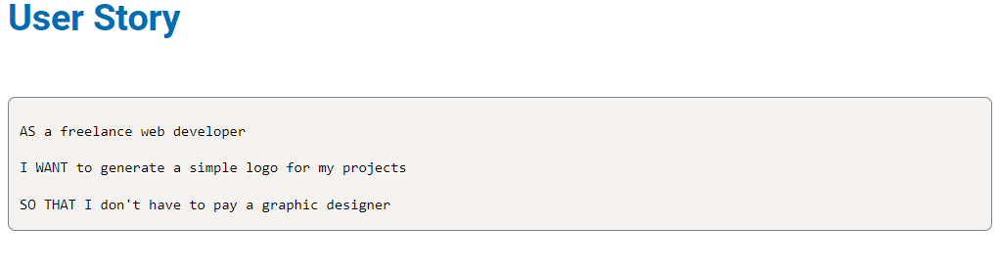
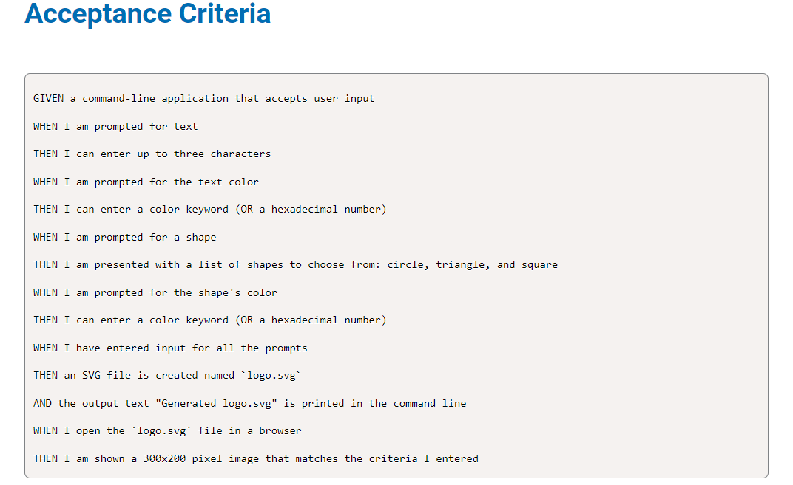

# svg-logo-maker
challenge 10

## Description

Logo Maker is a tool for web developers to create simple logos easily. It runs in the command line and asks users for the logo name, text color, background color, and shape choice. Then, it creates a logo in SVG format with the provided details. 

## Table of Contents (Optional)

- [Installation](#installation)
- [Usage](#usage)
- [Credits](#credits)
- [License](#license)

## Installation

-Clone the repository to local machine using: git clone <repository_url>
-Navigate to the project using: Cd <repository_url>
-Install dependencies using: npm install
-Start coding!

## Usage
-Open your terminal or command prompt.
-Navigate to the project directory.
-Run the application:using node index.js
-Follow the prompts to enter text, text color, shape, and shape color.
-Once you have entered input for all prompts, the application will generate an SVG file named logo.svg in the project directory.
-Check the command line for the message "Generated logo.svg" to confirm that the logo has been successfully created.
-Open the logo.svg file in a browser to view the generated -logo as a 300x200 pixel image.

Video walk throughs

Making the SVG Logo:

https://icecreamapps.com/v/bcxn6c8

Testing the shapes:

 https://icecreamapps.com/v/ed6rmx9

## Credits

https://www.shecodes.io/athena/73117-how-to-generate-an-array-of-random-colors-in-javascript#:~:text=Sure%2C%20to%20generate%20an%20array,a%20color%20in%20hexadecimal%20format.&text=const%20colors%20%3D%20%5B%5D%3B%20for%20 let,%3D%20%22%23%22%20%2B%20Math.

https://www.freecodecamp.org/news/generate-colors-in-javascript/

https://www.w3schools.com/graphics/tryit.asp?filename=trysvg_rect0

view-source:https://static.fullstack-bootcamp.com/fullstack-ground/module-10/circle.svg
## License

MIT

## Badges

